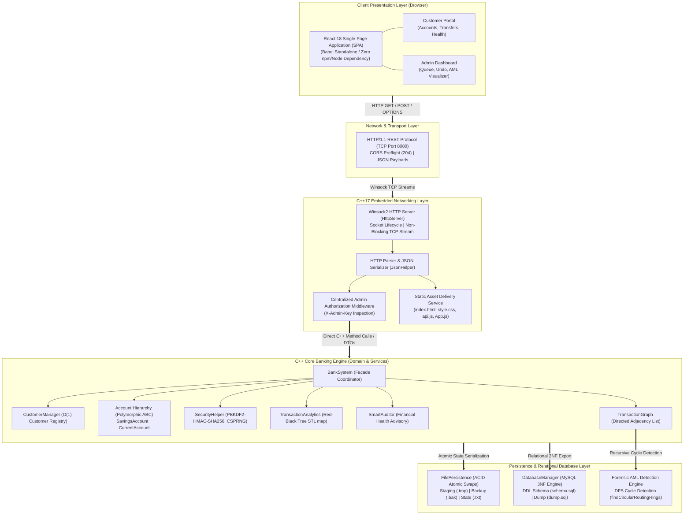
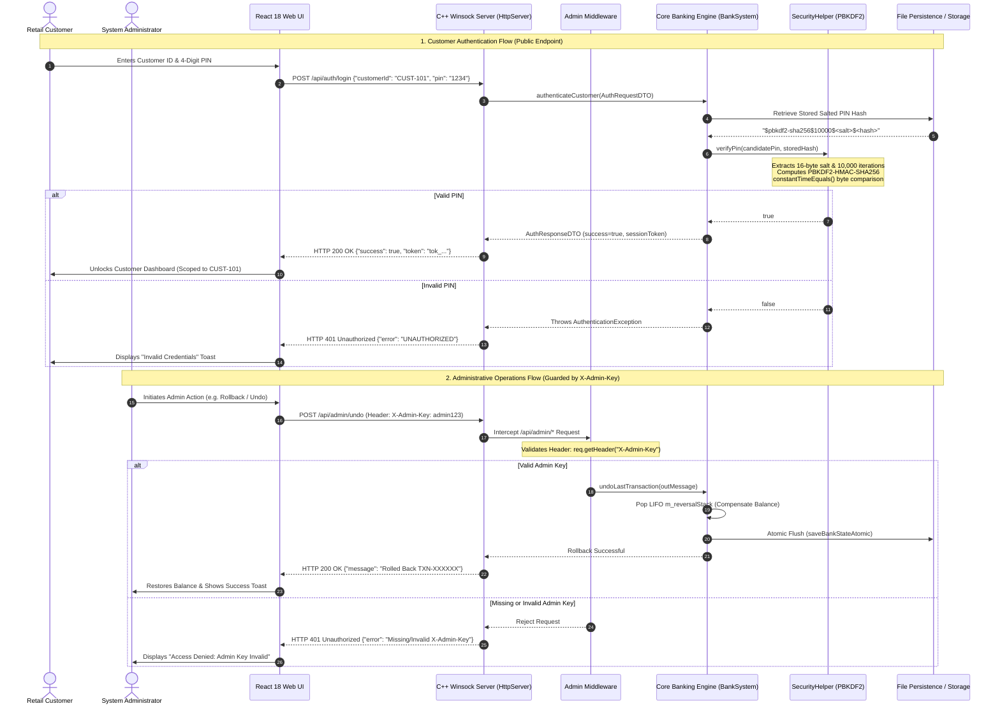
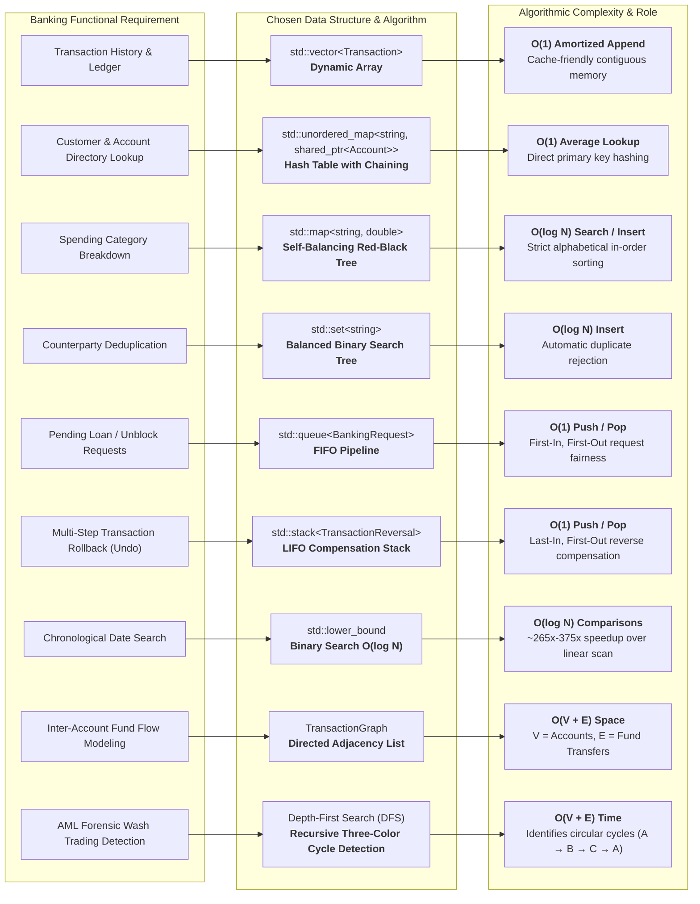
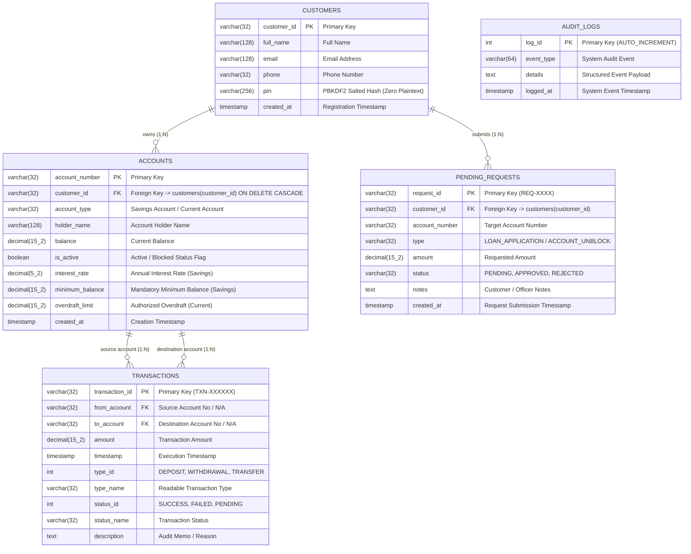

# Smart Banking Management System — Architecture Diagrams

This document contains the official architectural diagrams for the **Smart Banking Management System**, designed for project documentation, technical reports, and college viva examinations.

---

## 1. Main System Architecture

The system is organized into a 5-tier architecture connecting the zero-dependency React frontend to the pure C++17 core engine, native Winsock2 networking layer, and persistent storage abstractions.

---

## 2. Authentication & Authorization Flow

The system strictly decouples public customer authentication from guarded administrative operations:

---

## 3. Data Structures & Algorithms (DSA) Architecture

Every major data structure in the standard C++ library and domain models is mapped to a specific banking requirement:

---

## 4. Relational Database Architecture (MySQL 3NF)

The system enforces relational database integrity matching standard **Third Normal Form (3NF)** rules:

