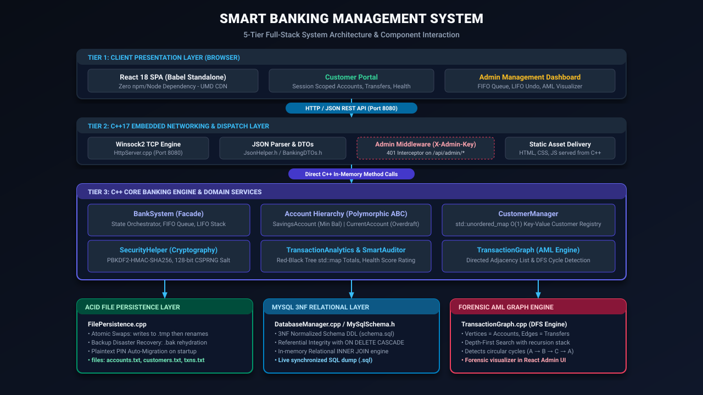
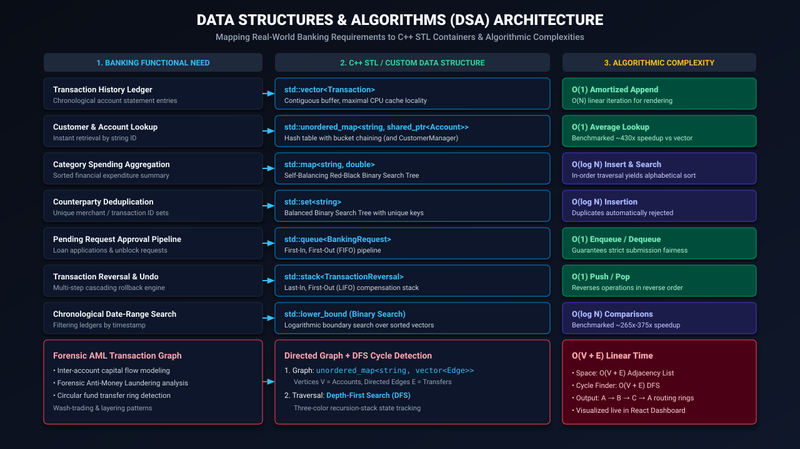
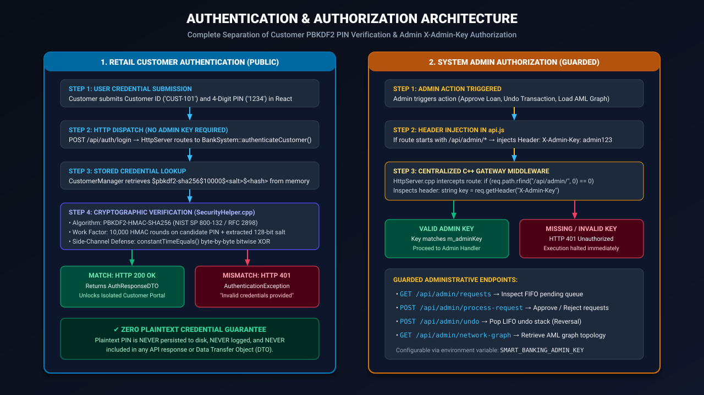
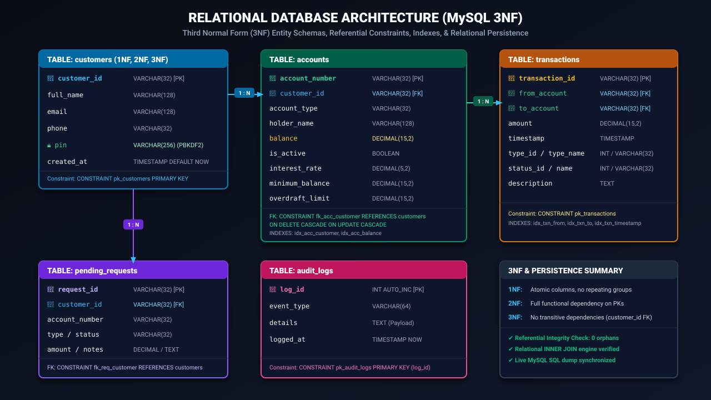

---
marp: true
theme: gaia
_class: lead
paginate: true
backgroundColor: #090d16
color: #f8fafc
style: |
  section {
    font-family: -apple-system, BlinkMacSystemFont, 'Segoe UI', Roboto, sans-serif;
    padding: 40px;
    background: #090d16;
    color: #f1f5f9;
  }
  h1 { color: #38bdf8; font-size: 2.2em; margin-bottom: 0.2em; }
  h2 { color: #34d399; font-size: 1.5em; border-bottom: 2px solid #1e293b; padding-bottom: 8px; }
  h3 { color: #fbbf24; font-size: 1.2em; }
  table { width: 100%; border-collapse: collapse; font-size: 0.85em; margin-top: 15px; }
  th { background-color: #1e293b; color: #38bdf8; padding: 10px; border: 1px solid #334155; }
  td { padding: 8px 12px; border: 1px solid #334155; }
  .badge { background: #1e293b; border: 1px solid #38bdf8; color: #38bdf8; padding: 4px 10px; border-radius: 6px; font-size: 0.8em; display: inline-block; margin-right: 6px; }
---

# Smart Banking Management System

### A C++17 Full-Stack Banking System Using OOP, DSA, REST API, React & MySQL

<br>

**Student Name:** [Student Name]  
**Roll Number / USN:** [Roll Number / USN]  
**Department:** [Department of Computer Science & Engineering]  
**Institution:** [College / University Name]  
**Academic Year:** [Academic Year 2025 - 2026]  

<br>

`<C++17 Core>` `<React 18 SPA>` `<Winsock2 REST API>` `<MySQL 3NF>` `<DSA & Graph>` `<PBKDF2 Security>`

---

## Slide 2 — Problem Statement

### Motivation & Context
Traditional academic banking applications are typically built as primitive CLI utilities focused exclusively on basic deposit and withdrawal balance mutations. They lack enterprise architecture, network concurrency, algorithmic rigor, cryptographic security, and modern web integration.

### The Smart Banking Solution
This project bridges the gap between academic theory and real-world software engineering:
* **Domain Modeling**: Robust multi-class inheritance hierarchy with polymorphic limit validation.
* **Algorithmic Optimization**: In-memory STL container optimization for sub-millisecond retrieval.
* **Cryptographic Security**: PBKDF2 salted PIN hashing with constant-time verification.
* **Compliance & AML**: Forensic transaction graph analysis with automated cycle detection.
* **Full-Stack Connectivity**: Native C++ Winsock2 REST API server coupled to a React 18 dashboard.
* **Dual Persistence**: Standalone crash-resilient file persistence + 3NF MySQL relational database.

---

## Slide 3 — Project Objectives

1. **Modular C++17 Engine**: Develop a high-performance banking core using decoupled domain models, DTOs, and RAII memory safety.
2. **Demonstrate OOP Principles**: Showcase Inheritance, Polymorphism, Encapsulation, Abstraction, and Custom Exception Hierarchies.
3. **Real-World DSA Integration**: Implement and benchmark 9 STL containers and algorithms with asymptotic Big-O efficiency proofs.
4. **Cryptographic Authentication**: Implement salted PBKDF2-HMAC-SHA256 and constant-time comparison to secure customer credentials.
5. **Native C++ REST API**: Engineer an embedded Winsock2 HTTP server routing JSON payloads without external third-party web frameworks.
6. **Modern React 18 Web Interface**: Deliver a responsive Single Page Application with interactive banking forms and an AML graph visualizer.
7. **Relational Database Design**: Formulate a Third Normal Form (3NF) MySQL schema with cascade referential integrity.
8. **Forensic Transaction Analytics**: Build financial health scoring and Depth-First Search (DFS) AML circular money-routing detection.

---

## Slide 4 — Technology Stack

### Visual Architecture Pillars

* **Backend & Core Engine**
  * Language: **C++17** (ISO Standard C++)
  * Standard Library: **C++ STL** (Containers, Algorithms, Smart Pointers)
  * Networking: **Winsock2** (Multi-Threaded HTTP REST Server)
  * Serialization: Pure C++ JSON Serializer/Parser (`JsonHelper`)

* **Frontend & Client**
  * UI Library: **React 18** (Functional Components, Hooks)
  * Languages: **JavaScript (ES6+)**, **HTML5**, **CSS3**
  * Visualizer: SVG Directed Transaction Network Graph

* **Database & Persistence**
  * RDBMS: **MySQL 8.0+ / MariaDB** (InnoDB Storage Engine)
  * Design: **Third Normal Form (3NF)** with Foreign Key Constraints
  * Local Storage: Resilient Atomic File Staging (`.tmp` -> Atomic Swap -> `.bak` recovery)

* **Security & Cryptography**
  * Hash Function: **PBKDF2-HMAC-SHA256** (10,000 rounds)
  * Entropy: **128-bit CSPRNG Salt** (Windows CryptoAPI `CryptGenRandom`)
  * Authorization: Centralized **`X-Admin-Key`** API Middleware

---

## Slide 5 — System Architecture



### 5-Tier Data Flow:
1. **Presentation Layer**: React 18 Single Page Application providing Customer & Admin portals.
2. **Transport Layer**: Native C++ Winsock2 HTTP Server on port 8080 parsing REST JSON requests.
3. **Core Banking Engine**: `BankSystem`, `CustomerManager`, `SecurityHelper` executing business rules.
4. **Analytics & AML Layer**: `TransactionAnalytics`, `SmartAuditor`, `TransactionGraph` auditing transactions.
5. **Dual Persistence Layer**: Crash-resilient file persistence alongside MySQL 3NF relational storage.

---

## Slide 6 — Object-Oriented Programming (OOP) Design

```text
                           Account (Abstract Base Class)
                           ├── m_accountNumber, m_balance, m_isActive
                           ├── virtual void calculateInterest() = 0
                           ├── virtual bool withdraw() = 0
                           /                             \
                          /                               \
     SavingsAccount (Derived)                  CurrentAccount (Derived)
     ├── m_interestRate (4.0%)                 ├── m_overdraftLimit ($1,000)
     ├── m_minimumBalance ($500)               └── Overdraft balance logic
     └── Min-balance check
```

### Core Concepts Demonstrated:
* **Encapsulation**: Private state fields (`m_balance`, `m_pinHash`); mutations strictly via public methods.
* **Abstraction**: `Account` exposes an abstract banking interface while hiding balance reconciliation mechanics.
* **Inheritance & Polymorphism**: Dynamic dispatch through `std::shared_ptr<Account>` base-class pointers.
* **Exception Hierarchy**: Derived from `std::runtime_error`: `InvalidAmountException`, `InsufficientFundsException`, `AccountBlockedException`, `EntityNotFoundException`, `AuthenticationException`.

---

## Slide 7 — Data Structures & Algorithms Architecture



### Mapping Real-World Banking Needs to C++ STL Containers:
* **`std::vector`**: Append-only transaction histories (`Account::m_transactionHistory`)
* **`std::unordered_map`**: Instant $O(1)$ account & customer lookup (`BankSystem::m_accounts`)
* **`std::map`**: Self-balancing Red-Black tree for sorted expenditure categories
* **`std::set`**: Balanced BST for merchant counterparty deduplication
* **`std::queue`**: FIFO pipeline for loan and unblock request processing
* **`std::stack`**: LIFO cascading transaction rollback and undo engine
* **Binary Search**: $O(\log N)$ logarithmic date-range filtering on sorted transaction ledgers
* **Directed Graph & DFS**: Adjacency list modeling capital flows with AML cycle detection

---

## Slide 8 — DSA Complexity Analysis

| Data Structure / Algorithm | Banking Application | Time Complexity | Space Complexity |
| :--- | :--- | :---: | :---: |
| **`std::vector`** | Chronological Transaction Ledger | $O(1)$ amortized append | $O(N)$ contiguous |
| **`std::unordered_map`** | Account & Customer Lookup | $O(1)$ average ($O(N)$ worst) | $O(N)$ hash buckets |
| **`std::map`** | Sorted Category Analytics | $O(\log N)$ insert / read | $O(N)$ Red-Black tree |
| **`std::set`** | Counterparty Deduplication | $O(\log N)$ insert / read | $O(N)$ balanced BST |
| **`std::queue`** | Administrative Pending Pipeline | $O(1)$ enqueue / dequeue | $O(N)$ sequential |
| **`std::stack`** | Multi-Step Transaction Undo | $O(1)$ push / pop | $O(N)$ sequential |
| **Binary Search** (`std::lower_bound`) | Chronological Ledger Search | $O(\log N)$ comparisons | $O(1)$ auxiliary |
| **Directed Graph** | Transaction Fund Flow Network | $O(1)$ edge addition | $O(V + E)$ adj list |
| **DFS Cycle Detection** | Anti-Money Laundering Rings | $O(V + E)$ traversal | $O(V)$ recursion |

> **Academic Distinction**: Measured benchmark performance (e.g. ~293x speedup on 5,000 items) and asymptotic Big-O complexity ($O(\log N)$ vs $O(N)$) are fundamentally different concepts. Benchmarks measure hardware execution speed; Big-O defines mathematical growth limits.

---

## Slide 9 — Core Banking Operations

```text
[Customer Registration] ──► [PBKDF2 Salted Login] ──► [Account Creation (Savings / Current)]
                                                                  │
                                                                  â–¼
[Reversal Undo Engine] ◄── [Immutable Ledger (TXN)] ◄── [Deposit / Withdraw / Transfer]
                                      │
                                      â–¼
                      [Smart Analytics & Spending Breakdown]
```

### Operational Rules & Robustness:
* **Savings Account**: Enforces mandatory minimum balance threshold ($500.00); rejects underflow.
* **Current Account**: Permits withdrawals beyond zero up to authorized overdraft limit ($1,000.00).
* **Atomic Fund Transfer**: Executes source debit (`TRANSFER_OUT`) and destination credit (`TRANSFER_IN`) synchronously.
* **Non-Destructive Rollback**: Compensating transactions pop from the LIFO stack to safely restore prior state without deleting financial history.

---

## Slide 10 — Smart Analytics & Anti-Money Laundering (AML)

### A. Financial Health Analytics (`SmartAuditor`)
* Evaluates complete cash inflows and outflows to compute net savings and savings rates.
* Generates holistic health grades: `EXCELLENT`, `HEALTHY`, `MODERATE`, `NEEDS_ATTENTION`, `CRITICAL`.
* Delivers automated financial advisories based on liquidity reserves.

### B. Forensic AML Transaction Graph (`TransactionGraph`)
* **Mathematical Model**:
  * Accounts = Graph Vertices ($V$)
  * Fund Transfers = Directed Edges ($E$) annotated with amount, transaction ID, and timestamp.
* **Circular Routing Detection**:
  * Employs recursive Depth-First Search (DFS) with recursion-stack state tracking (`visited` and `inStack`).
  * Identifies closed circular wash-trading loops:
    $$\text{Account } A \xrightarrow{\$10,000} \text{Account } B \xrightarrow{\$9,900} \text{Account } C \xrightarrow{\$9,800} \text{Account } A$$
  * Highlights illicit rings live on the React Admin Dashboard with red pulse alerts.

---

## Slide 11 — Authentication & Security Architecture



### Customer Authentication
* Plaintext PIN hashed at boundary using **PBKDF2-HMAC-SHA256**.
* **10,000 iterations** of HMAC key stretching.
* **128-bit CSPRNG salt** per customer (Windows CryptoAPI `CryptGenRandom`).
* **Constant-time comparison** (`constantTimeEquals`) neutralizes timing attacks.
* Format: `$pbkdf2-sha256$10000$<salt>$<hash>`. Zero plaintext stored on disk.

### Admin Authorization
* Dedicated middleware intercepts privileged `/api/admin/*` endpoints.
* Validates `X-Admin-Key` header; missing or invalid keys return `HTTP 401 Unauthorized`.
* Customer endpoints (`/api/auth/*`, `/api/accounts/*`) are fully decoupled and never require admin credentials.

---

## Slide 12 — Relational Database Architecture (MySQL 3NF)



### 3NF Relational Schema Design:
* **`customers`** (PK: `customer_id`): Customer contact details & salted PBKDF2 hash.
* **`accounts`** (PK: `account_number`, FK: `customer_id`): Balances, interest rates, overdraft limits.
  * `ON DELETE CASCADE ON UPDATE CASCADE` guarantees zero orphaned accounts.
* **`transactions`** (PK: `transaction_id`): Double-entry ledger with `idx_txn_from` and `idx_txn_to`.
* **`pending_requests`** (PK: `request_id`, FK: `customer_id`): Back-office approval pipeline.
* **`audit_logs`** (PK: `log_id`): Independent tamper-evident system security audit log.

---

## Slide 13 — Testing & Verification Results

### 12 / 12 Automated Verification Suites PASSED (100% Integrity)

```text
[✓] Suite 01: OOP Account Hierarchy & Dynamic Polymorphism           [PASSED]
[✓] Suite 02: Customer Authentication & PIN PBKDF2 Security          [PASSED]
[✓] Suite 03: std::queue FIFO Request Pipeline Integrity             [PASSED]
[✓] Suite 04: std::stack LIFO Cascading Transaction Rollback        [PASSED]
[✓] Suite 05: std::map Red-Black Tree Category Aggregation           [PASSED]
[✓] Suite 06: std::set Balanced BST Counterparty Deduplication       [PASSED]
[✓] Suite 07: Directed Graph Adjacency List & DFS Cycle Detection    [PASSED]
[✓] Suite 08: Binary Search O(log N) Algorithmic Speedup Proof       [PASSED]
[✓] Suite 09: Embedded C++ REST API Routing & JSON Endpoints         [PASSED]
[✓] Suite 10: MySQL 3NF Schema & SQL Dump Engine                     [PASSED]
[✓] Suite 11: Frontend SPA Static Asset Delivery (React)             [PASSED]
[✓] Suite 12: Full-Stack End-to-End Workflow & ACID Persistence      [PASSED]
```

* **Compilation Quality**: Clean build under MinGW GCC 6.3.0 with **0 compiler warnings** and **0 linker errors**.

---

## Slide 14 — Limitations & Future Scope

### Current Educational Scope
* **Transport Encryption**: Embedded Winsock server serves HTTP (production requires TLS 1.3/HTTPS).
* **Credential Hashing**: PBKDF2 implemented for portability (production recommends memory-hard Argon2id).
* **Admin Authorization**: Uses shared header key (production mandates asymmetric RS256 JWTs / OAuth2).
* **Storage**: Flat-file persistence is designed for offline standalone demonstration, not multi-node cloud clusters.

### Future Scope & Enhancements
* **HTTPS / TLS 1.3**: Integrate OpenSSL / SChannel for end-to-end transport encryption.
* **Rate Limiting & Lockout**: Implement exponential backoff and 3-strike account lockouts against brute-force.
* **Machine Learning Fraud Detection**: Real-time graph neural network scoring of AML transaction rings.
* **Microservices & Cloud**: Containerize backend services with Docker and Kubernetes.

---

## Slide 15 — Conclusion

### Summary
The **Smart Banking Management System** successfully bridges systems programming and modern full-stack development. It proves that classical C++17, Object-Oriented principles, optimal Data Structures & Algorithms, cryptographic authentication, and 3NF database normalization can seamlessly power a responsive, modern web application.

<br>

# Thank You!

### Questions & Discussion

* **Documentation**: `docs/` (Architecture Diagrams, DSA Specifications, 3NF Database Manual)
* **Executable**: `SmartBankingSystem.exe --test` (12/12 Automated Test Suites)